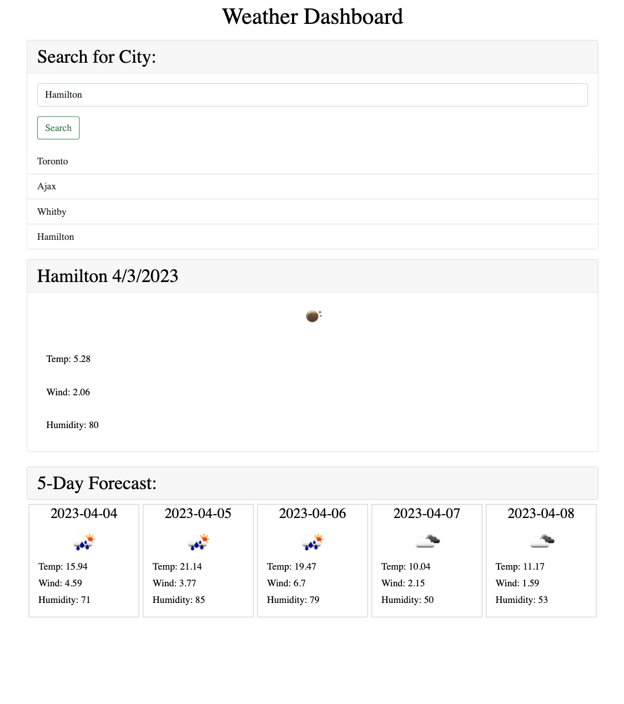
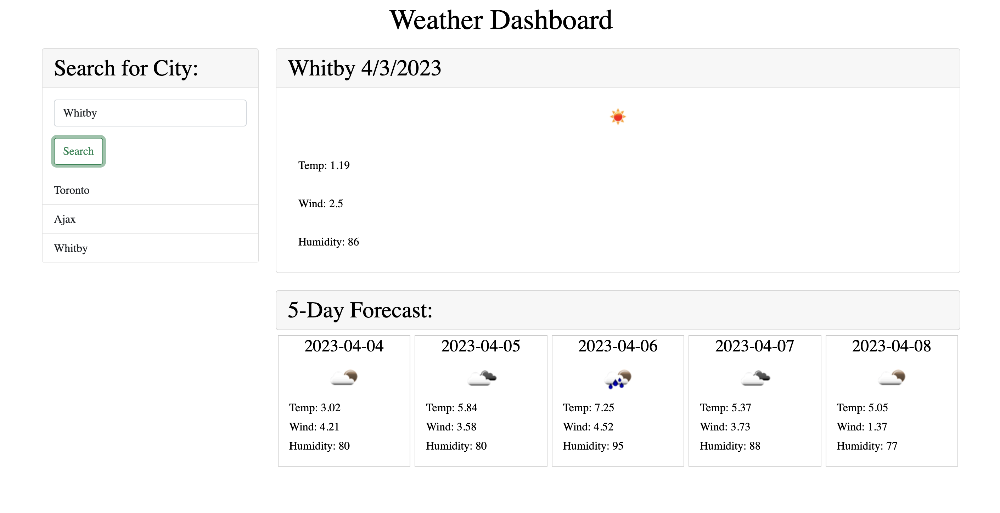

# Weather Dashboard

[![Issues][issues-shield]][issues-url]
[![MIT License][license-shield]][license-url]
[![github][github-shield]][github-url]

<!-- PROJECT LOGO -->
 

  

<h3 align="center">Weather Dashboard</h3>

  

    Our site is developed for anyone looking to have access to the weather from anywhere. They can access the the current weather along with the 5 day weather forecast for any searched city. 
     
    <a href="https://github.com/lavanyavirushan/m6c-weather-dashboard"><strong>Explore the docs »</strong></a>
     
     
    <a href="https://lavanyavirushan.github.io/m6c-weather-dashboard/">View Demo</a>
    ·
    <a href="https://github.com/lavanyavirushan/m6c-weather-dashboard/issues">Report Bug</a>
    ·
    <a href="https://github.com/lavanyavirushan/m6c-weather-dashboard/issues">Request Feature</a>
  

<!-- TABLE OF CONTENTS -->

  
Table of Contents

  <ol>
    <li>
      <a href="#about-the-project">About The Project</a>
    </li>
    <li><a href="#usage">Usage</a></li>
    <li><a href="#license">License</a></li>
    <li><a href="#contact">Contact</a></li>
  </ol>

<!-- ABOUT THE PROJECT -->

## About The Project

[![Screenshot][product-screenshot]](https://lavanyavirushan.github.io/m6c-weather-dashboard/)

This site allows users to access the current and 5 day forecasted weather for the city searched. They can retrieve searched city using the history section of the site.

(<a href="#readme-top">back to top</a>)

## Usage

As a traveler, you can see the weather outlook for multiple citites so that you can plan a trip accordingly.

(<a href="#readme-top">back to top</a>)

<!-- LICENSE -->

## License

Distributed under the MIT License. See `LICENSE` for more information.

(<a href="#readme-top">back to top</a>)

<!-- CONTACT -->

## Contact

Lavanya Virushan - [@lavanyavirushan](https://github.com/lavanyavirushan)

(<a href="#readme-top">back to top</a>)

[contributors-shield]: https://img.shields.io/github/contributors/lavanyavirushan/m6c-weather-dashboard
[issues-shield]: https://img.shields.io/github/issues/lavanyavirushan/m6c-weather-dashboard
[issues-url]: https://github.com/lavanyavirushan/m6c-weather-dashboard/issues
[license-shield]: https://img.shields.io/github/license/lavanyavirushan/m6c-weather-dashboard.svg?style=for-the-badge
[license-url]: https://github.com/lavanyavirushan/m6c-weather-dashboard/blob/main/LICENSE
[github-shield]: https://img.shields.io/badge/-github-black.svg?style=for-the-badge&logo=github&colorB=555
[github-url]: https://github.com/lavanyavirushan/m6c-weather-dashboard
